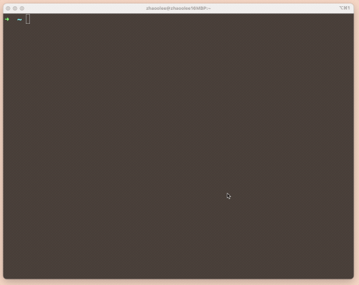

# WelcomeMrStark


本项目灵感来自自钢铁侠2

🌈The inspiration for this project comes from Iron Man 2.

https://github.com/zhaoolee/WelcomeMrStark




这是一个根据本机系统时间，可以自动向登录人员礼貌问好，并支持自定义配置显示世界各地时间的脚本
🌈This is a script that can automatically greet the logged-in personnel politely according to the local system time, and supports custom configuration to display the time in various parts of the world.


## 如何使用 / How To Use


安装figlet
🌈Install figlet

```
# Ubuntu
apt install figlet
# CentOS
yum install figlet
# macOS
brew install figlet
```


使用脚本
🌈 Run Script

```
git clone --depth=1 https://github.com/zhaoolee/WelcomeMrStark  ~/.WelcomeMrStark
# zsh
echo "source ~/.WelcomeMrStark/WelcomeMrStark.sh" >> ~/.zshrc
# bash
echo "source ~/.WelcomeMrStark/WelcomeMrStark.sh" >> ~/.bashrc
```

## 后续更新计划（画饼）/ Future Update Plan (Pie in the sky)


支持配置生日，展示本人星座运势，展示黄历，宜忌(中西合璧)
🌈Support for configuring birthdays, displaying personal horoscope, showing almanac, taboos (a blend of Chinese and Western cultures)


随机打印一句英语经典电影台词(Romantic Code)
🌈Randomly print a classic line from an English movie (Romantic Code)


随机展示一句100句学完7000个雅思单词的长句(不断重复是记忆的黄金定律)
🌈Randomly display a long sentence from the 100 sentences that cover 7000 IELTS vocabulary words (constant repetition is the golden rule of memory)


各国节假日提醒，包含节假日倒计时(离过年，仅剩N天)
🌈Reminders for holidays in various countries, including a countdown to holidays (N days left until the Chinese New Year)


休息日提醒(Work-Life Balance)
🌈Rest day reminder (Work-Life Balance)


下班提醒(还有2小时50分钟10秒下班...)
🌈Off-work reminder (2 hours, 50 minutes, and 10 seconds left until off work...)
