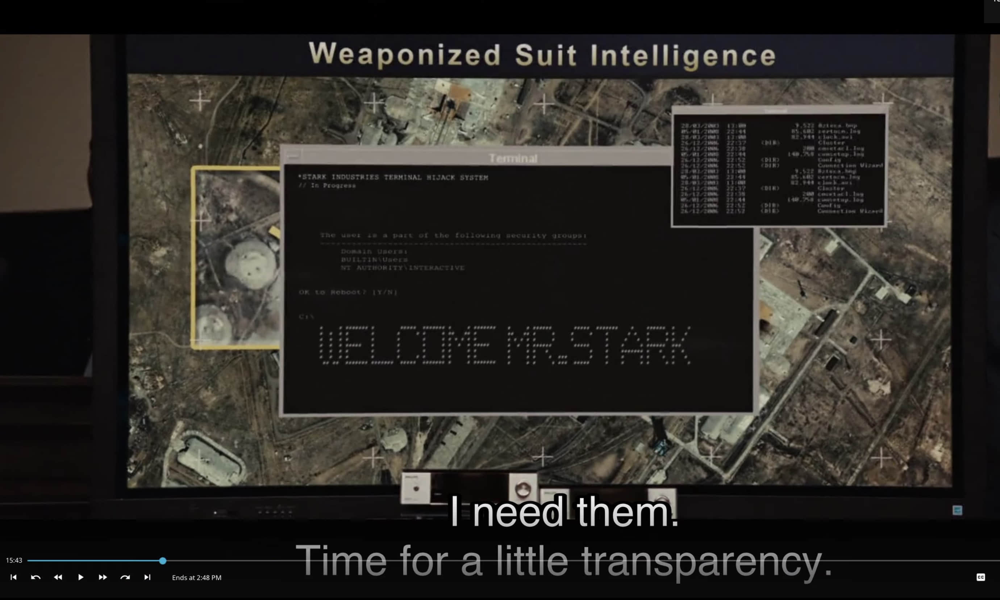
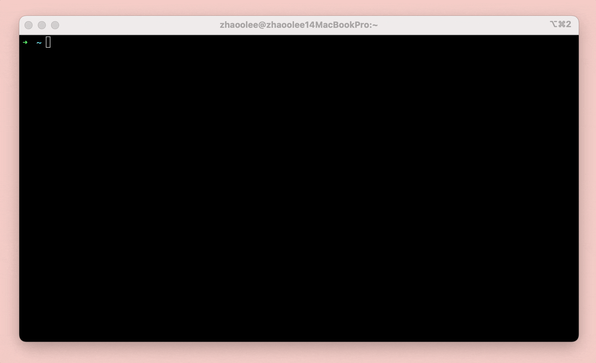

# WelcomeMrStack


本项目灵感来自自钢铁侠2

🌈The inspiration for this project comes from Iron Man 2.






这是一个根据本机系统时间，可以自动向登录人员礼貌问好，并支持自定义配置显示世界各地时间的脚本

🌈This is a script that can automatically greet the logged-in personnel politely according to the local system time, and supports custom configuration to display the time in various parts of the world.


## 如何使用 / How To Use


安装figlet
🌈Install figlet

```
# Ubuntu
apt install figlet
# CentOS
yum install figlet
# macOS
brew install figlet
```


使用脚本
🌈 Run Script

```
git clone --depth=1 https://github.com/zhaoolee/WelcomeMrStark  ~/.WelcomeMrStark
# zsh
echo "source ~/.WelcomeMrStark/WelcomeMrStark.sh" >> ~/.zshrc
# bash
echo "source ~/.WelcomeMrStark/WelcomeMrStark.sh" >> ~/.bashrc
```

